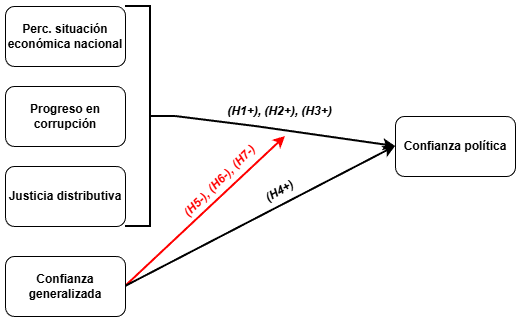

# Antecedentes conceptuales y empíricos

```{r echo=FALSE}
knitr::opts_chunk$set(out.width="80%", fig.pos = "!ht", out.extra = "")
```

## Confianza política

La confianza política se define como “la expectativa de que las instituciones políticas funcionen según reglas justas incluso en ausencia de escrutinio constante”[^1] [@marienMeasuringPoliticalTrust2013, p.16]. En este sentido, esta categoría forma parte del más abarcador concepto de apoyo político acuñado por Easton [-@eastonSystemsAnalysisPolitical1965; -@eastonReassessmentConceptPolitical1975]. Este último, refiere a la forma en que un individuo se orienta evaluativamente hacia los componentes del sistema político, ya sea mediante sus actitudes o su comportamiento [@eastonReassessmentConceptPolitical1975]. A su vez, el autor divide los componentes del sistema político en tres: las autoridades en ejercicio, el régimen político y la comunidad política. De esta forma, el apoyo político se entiende como un *continuum* que va desde el apoyo específico, orientado hacia las autoridades en función de la evaluación de su desempeño, hasta el apoyo difuso, dirigido hacia los principios y valores que subyacen al sistema político y a la comunidad que lo alberga [@eastonReassessmentConceptPolitical1975; @norrisDemocraticDeficitCritical2011]. En este marco, la confianza política aparece como un indicador intermedio de apoyo, dirigido a las instituciones que forman parte del régimen político [@vandermeerDeeplyRootedConcern2017; @zmerliPoliticalTrust2022].

A su vez, la confianza política tiene sus fundamentos en un tipo específico de confianza estratégica que se puede resumir bajo la famosa fórmula “A confía en B para que haga x”[^2] [@hardinWeWantTrust1999, p.26]. Esto implica que dicho concepto es relacional, en cuanto contempla un sujeto que confía y un objeto en quien se confía, y situacional, en cuanto refiere a cierto tipo de acción o contexto en el que se desenvuelve esta relación [@citrinPoliticalTrustCynical2018; @vandermeerEconomicPerformancePolitical2018; @vandermeerDeeplyRootedConcern2017]. En este sentido, entablar una relación de confianza implica un riesgo para el sujeto, el cual se encuentra en una relación de incertidumbre en torno al comportamiento que va a llevar a cabo el objeto en el que deposita su confianza. Es por esto que, desde el punto de vista de la confianza estratégica, la decisión de confiar depende en gran medida de la información y la experiencia que tenga el sujeto sobre el comportamiento del objeto de confianza [@uslanerMoralFoundationsTrust2002; @uslanerStudyTrust2017]. Así, podríamos decir que, para que A confíe en B para que haga x,  A tiene que tener alguna certeza de que, desde la base de información sobre experiencias pasadas con B y con objetos del mismo tipo, B efectivamente es capaz de llevar a cabo x. 

En este sentido, se argumenta que la confianza en las instituciones políticas depende de la evaluación que los ciudadanos hagan de su desempeño en llevar a cabo determinados *outputs* en concordancia con las expectativas que tienen sobre estas. A grandes rasgos, los individuos en los regímenes democráticos valoran a sus instituciones en función de su capacidad para garantizar prosperidad económica para amplios sectores de la población, mediante un contexto económico y político en concordancia con valores como la justicia, la transparencia y la equidad [@andersonSensitiveLeftImpervious2008; @vandermeerEconomicPerformancePolitical2018; @vandermeerDeeplyRootedConcern2017; @zmerliPoliticalTrust2022; @zmerliIncomeInequalityDistributive2015]. Desde esta perspectiva, la confianza política se concibe como fundamentalmente endógena a las instituciones del régimen, y se encuentra en todo momento susceptible de variar en función de los cambios económicos, sociales y políticos que ocurren al interior de un país [@newtonSocialPoliticalTrust2017].

*EN ESTA PARTE CENTRARSE EN LA CONFIANZA POLÍTICA COMO TAL Y EN SUS ANTECEDENTES EMPÍRICOS. HACER UN PREVIEW DE QUE GENERALMENTE SE ASOCIA CON DOS GRUPOS DE VARIABLES QUE DARÍAN CUENTA DE QUE EL FENÓMENO TIENE NATURALEZAS DISTINTAS Y QUE SE VA A AHONDAR MÁS EN LAS SIGUIENTES SECCIONES.*
	
[^1]: Traducción propia.
[^2]: Traducción propia.
 
## Percepción del desempeño institucional

*HABLAR DE QUE EN ESTA PERSPECTIVA SE ENTIENDE QUE LA CONFIANZA POLÍTICA TIENE SUS FUNDAMENTOS EN UN TIPO ESPECÍFICO DE CONFIANZA ESTRATÉGICA*

Quienes adoptan la perspectiva institucional señalan que la confianza política depende de la evaluación que llevan a cabo los ciudadanos sobre el desempeño de las instituciones del régimen político [@vandermeerEconomicPerformancePolitical2018]. Para estudiar esta hipótesis, se adoptan distintos indicadores políticos y económicos. En el marco del presente estudio, se hará énfasis en el uso de tres: desempeño económico, corrupción y desigualdad en la distribución de ingresos. El enfoque sobre estos tres fenómenos se fundamenta en la importancia que estos tienen en el contexto chileno y latinoamericano.

### Desempeño económico

En la literatura existe un consenso global en torno a la importancia que tiene para la confianza política la evaluación que los individuos llevan a cabo del ámbito económico [@eastonReassessmentConceptPolitical1975; @leeEconomicPerformanceIncome2020; @mishlerWhatAreOrigins2001; @norrisDemocraticDeficitCritical2011; @oskarssonGeneralizedTrustPolitical2010; @vandermeerEconomicPerformancePolitical2018; @wangGovernmentPerformanceCorruption2016]. Lo anterior implicaría que los ciudadanos valorarían sus instituciones en función de la capacidad que estas tienen de satisfacer sus necesidades materiales mediante el incremento en los estándares de vida de la población [@quarantaDoesEconomyReally2016; @thomassenSupportDemocraticValues1998; @mcallisterEconomicPerformanceGovernments1999]. A este respecto, es necesario tener en cuenta que esta evaluación no necesariamente se condice con lo informado por indicadores macroeconómicos objetivos [@vandermeerEconomicPerformancePolitical2018]. Esto se debe a que la percepción que los individuos construyen en este ámbito se ve mediada por otros factores como los medios de comunicación y las expectativas individuales [@mcallisterEconomicPerformanceGovernments1999]. A su vez, esta depende del indicador (tasa de desempleo, crecimiento económico, inflación, salarios reales, etc.) al que los individuos le den más importancia en un momento determinado [@daltonDemocraticChallengesDemocratic2004]. Teniendo esto en cuenta, las investigaciones previas han ocupado tanto mediciones macroeconómicas particulares como indicadores sobre la percepción general que los individuos tienen del estado de la economía. Respecto a la pertinencia de las primeras, las investigaciones arrojan resultados mixtos [@andersonCorruptionPoliticalAllegiances2003; @leeEconomicPerformanceIncome2020; @mishlerWhatAreOrigins2001; @vandermeerPoliticalTrustEvaluation2017]. Por el contrario, los indicadores de percepción del desempeño económico han demostrado consistentemente tener efecto sobre la confianza política. Lo anterior se ha comprobado en diversos contextos, como lo son las regiones de América del Norte y Europa Occidental [@oskarssonGeneralizedTrustPolitical2010; @torcalDeclinePoliticalTrust2014a], Europa Oriental [@mishlerWhatAreOrigins2001], África [@stoyanTrustGovernmentInstitutions2016] y América Latina [@bargstedPoliticalTrustLatin2017; @mainwaringStateDeficienciesParty2006; @mattesSocialPoliticalTrust2018; @stoyanTrustGovernmentInstitutions2016; @torcalConfianzaPoliticaEuropa2015]. A su vez, la presencia de este efecto se ha mantenido en el caso chileno [@riffoQueInfluyeConfianza2019; @saldanazunigaConfianzaInstitucionesPoliticas2019; @segoviaMalaiseDemocracyChile2016].

En paralelo, también es importante dar cuenta de que la percepción del desempeño económico puede articularse desde dos puntos de vista [@vandermeerEconomicPerformancePolitical2018]: por un lado, desde una perspectiva sociotrópica que pone el foco en las condiciones económicas nacionales; por otro lado, desde una perspectiva egotrópica que pone el foco en las circunstancias económicas individuales. En el marco de su relación con la confianza política, se argumenta que este indicador es evaluado en mayor grado a partir de criterios colectivos (sociotrópicos) que de criterios individuales (egotrópicos) [@mcallisterEconomicPerformanceGovernments1999]. Esto último es apoyado por la evidencia empírica, en la cual las evaluaciones sociotrópicas han demostrado un mayor efecto en la confianza institucional que las evaluaciones egotrópicas [@mainwaringStateDeficienciesParty2006; @torcalDeclinePoliticalTrust2014a; @torcalResponsivenessPerformanceCorruption2021; @vandermeerEconomicPerformancePolitical2018]. De esta forma, para efectos de esta investigación conviene centrarse en la evaluación que los individuos llevan a cabo de la situación económica nacional. No obstante lo anterior, resulta importante destacar que esta evaluación sociotrópica del desempeño económico puede manifestarse en distintas temporalidades, ya sea en retrospectiva, en el presente o respecto al futuro. Las percepciones derivadas de estas, aunque relacionadas, podrían diferir entre sí [@torcalResponsivenessPerformanceCorruption2021]. Pese a la importancia de la temporalidad en la evaluación, las investigaciones previas no le han prestado suficiente atención, utilizando indicadores que adoptan una u otra temporalidad sin mayor justificación [@mainwaringStateDeficienciesParty2006; @leeEconomicPerformanceIncome2020; @oskarssonGeneralizedTrustPolitical2010]. En contraste, en esta investigación se buscará medir la percepción de la situación económica nacional teniendo en cuenta la evaluación que los individuos llevan a cabo de este fenómeno en estas tres etapas: pasado, presente y futuro.

Teniendo en cuenta estas consideraciones, se presenta la primera hipótesis de la investigación:

  - *H1: La percepción de la situación económica nacional se relaciona positivamente con la confianza política. Es decir, los ciudadanos que evalúen de mejor forma la situación económica del país tendrán un mayor nivel de confianza política que los ciudadanos que evalúen de peor forma esta situación.* 

### Corrupción 

Junto con el desempeño económico, la literatura ha destacado la importancia de la relación entre la corrupción y la confianza política. En concordancia con otras investigaciones, el concepto de corrupción se entiende como "el uso indebido del cargo público para beneficio privado"[^3] [@sandholtzAccountingCorruptionEconomic2000, p.32]. A partir de esta definición es posible afirmar que este fenómeno socava principios básicos de la democracia, como son la transparencia en la toma de decisiones, la justicia e imparcialidad en la aplicación de leyes y el acceso equitativo al proceso político -como participante directo o como beneficiario- [@andersonCorruptionPoliticalAllegiances2003]. En contraste con estos ideales normativos, la corrupción entrega ventajas a unos sobre otros, debilitando así la creencia de que las instituciones y sus ocupantes actúan en beneficio del interés general y no orientados hacia intereses particulares [@beesleyCorruptionInstitutionalTrust2022; @uslanerCorruptionInequalityTrap2013]. Inicialmente, el mal uso de los recursos públicos y de las ventajas asociadas a posiciones al interior del aparato político-estatal puede ser atribuible a la deshonestidad de algunos funcionarios, lo que no implicaría necesariamente una peor evaluación de las instituciones políticas. Sin embargo, la regularización de episodios de este tipo a lo largo del tiempo llevaría a que los ciudadanos perciban estos comportamientos como parte del funcionamiento de las instituciones y, por tanto, disminuiría la confianza que depositan en estas [@beesleyCorruptionInstitutionalTrust2022]. En este sentido, los individuos que identifican el mal uso de fondos públicos para fines privados como una práctica recurrente al interior de una institución, van a calificar a esta de deshonesta e injusta, tendiendo a confiar menos en ella [@uslanerCorruptionInequalityTrap2013].

Diversas investigaciones han estudiado el vínculo que habría entre la corrupción y la confianza en las instituciones. A diferencia de lo ocurrido con el desempeño económico, para el caso de la corrupción tanto indicadores a nivel macro como la percepción de los individuos han demostrado tener un efecto significativo en el nivel de confianza política. Aunque demuestra ser importante en países con niveles relativamente menores de corrupción [@andersonCorruptionPoliticalAllegiances2003; @vandermeerPoliticalTrustEvaluation2017; @wangGovernmentPerformanceCorruption2016], este fenómeno cobra mayor relevancia en regiones con altos niveles de corrupción pública, como lo es el caso de América Latina. En este sentido, distintos estudios han revelado la centralidad que tiene la corrupción en la evaluación que los ciudadanos latinoamericanos hacen del desempeño de sus instituciones [@boothLegitimacyPuzzleLatin2009; @mainwaringStateDeficienciesParty2006; @morrisCorruptionTrustTheoretical2010; @seligsonImpactCorruptionRegime2002a; @stoyanTrustGovernmentInstitutions2016]. Para el caso chileno, al igual que en lo respectivo al desempeño económico, la tendencia global y regional se mantiene, por lo que se encuentra un efecto significativo de la corrupción pública en la confianza institucional [@riffoQueInfluyeConfianza2019; @saldanazunigaConfianzaInstitucionesPoliticas2019; @segoviaMalaiseDemocracyChile2016].

En base a lo anterior, se propone la segunda hipótesis de la investigación: 

  - *H2: El progreso en reducir la corrupción se relaciona positivamente con la confianza política. Lo anterior significa que los ciudadanos que perciban un mayor progreso en reducir la corrupción en el país van a tener un mayor nivel de confianza política respecto a los ciudadanos que perciban un menor progreso en reducir la corrupción.* 

[^3]: Traducción propia.

### Justicia distributiva

Por último, en las últimas décadas han surgido distintos autores que afirman la importancia que las percepciones de la distribución de ingresos tendrían en la construcción de los juicios de confianza en las instituciones políticas [@vandermeerEconomicPerformancePolitical2018]. Este planteamiento se erige, en concordancia con la teoría de la privación relativa, sobre el supuesto de que los individuos evalúan los productos de las instituciones políticas en referencia a estándares sobre lo que constituiría un resultado justo [@tylerSocialJustice2015]. En el caso de la desigualdad en la distribución de la riqueza, estos estándares estarían basados, por lo general, en tres principios: la igualdad, la equidad y la satisfacción de las necesidades básicas de cada uno [@tylerSocialJustice2015; @zmerliIncomeInequalityDistributive2015]. Estos principios constituyen lo que se conoce como "justicia distributiva". Según este concepto, en la medida en que los ciudadanos consideren la distribución de ingresos incompatible con cualquiera de estos principios, percibirán que se han transgredido dichos principios y confiarán menos en las instituciones políticas, atribuyéndoles la responsabilidad de mejorar esta situación [@tylerInfluencePerceivedInjustice1985; @zmerliIncomeInequalityDistributive2015].

La evidencia empírica sobre la relación entre justicia distributiva y confianza política ha demostrado ser consistente en distintas investigaciones. En este sentido, se evidencia que los ciudadanos que perciben una mayor desigualdad de ingresos al interior de sus comunidades tienden a calificar esta distribución como injusta, y por ende a demostrar menores niveles de confianza en sus instituciones políticas [@bobzienIncomeInequalityPolitical2023; @gustavssonInequalityTrustSweden2008; @leeEconomicPerformanceIncome2020]. A su vez, esta relación resulta extrapolable a contextos con niveles altos de desigualdad de ingresos como el latinoamericano [@garcia-sanchezEconomicInequalityUnfairness2025a; @wuIncomeInequalityDistributive2019; @zmerliIncomeInequalityDistributive2015]. No obstante lo anterior, no se encontraron investigaciones empíricas que den cuenta de esta relación para el caso chileno, más allá de su inclusión en estudios que se concentran en el contexto regional. A este respecto, se identifica la necesidad de producir información que permita dilucidar la particularidad de la relación entre justicia distributiva y confianza en las instituciones políticas en Chile.

A partir de los antecedentes expuestos, se plantea la tercera hipótesis de la investigación: 

  - *H3: La percepción de justicia distributiva se relaciona positivamente con la confianza política. Esto significa que los ciudadanos que perciban como justa la distribución de ingresos en el país van a tener un mayor nivel de confianza política respecto a los ciudadanos que la perciban  como injusta.*

## Confianza generalizada

*Hacer el contraste según el cual la confianza generalizada tendría sus fundamentos tambien en un tipo de confianza moral que sería la confianza generalizada y que no sería el producto de un calculo racional sino que tendría su origen en procesos de socialización temprana* *EN ZMERLI 2022, Van der Meer y Zmerli 2017 y en Mishler y Rose 2001 hablan más sobre esta perspectiva a rasgos generales*

Frente a la importancia que en el apartado anterior se le atribuyó a la percepción del desempeño institucional en la construcción de confianza política es necesario hacer una salvedad: este vínculo no se percibe con la misma intensidad en todos los ciudadanos. Por el contrario, este efecto se encuentra condicionado por diferencias en los valores, en las expectativas y en la atribución de responsabilidades entre los sujetos que evalúan [@vandermeerEconomicPerformancePolitical2018; @vandermeerPoliticalTrustEvaluation2017] [^4]. Tomando en cuenta el potencial analítico del estudio sobre el condicionamiento que estos distintos factores podrían tener en la confianza que los individuos depositan sobre las instituciones, resulta problemática la escasa atención que se le ha dado a la confianza generalizada como un posible moderador de la percepción del desempeño. En la gran mayoría de las investigaciones, la relación entre confianza generalizada y confianza política se ha estudiado exclusivamente de forma directa, es decir, asumiendo que los individuos que confían más en los otros confiarían en mayor grado en sus instituciones [@boothLegitimacyPuzzleLatin2009; @mainwaringStateDeficienciesParty2006; @mattesSocialPoliticalTrust2018; @morrisCorruptionTrustTheoretical2010; @zmerliWinnersLosersThree2013]. Lo anterior se sustenta sobre una concepción de la confianza en los otros como el producto de un cálculo racional llevado a cabo a partir de la experiencia acumulada sobre la confiabilidad de las otras personas [@newtonSocialPoliticalTrust2017]. Durante este apartado se argumentará que estas investigaciones han malentendido la naturaleza de la confianza generalizada, lo que les ha llevado a ignorar el potencial de este tipo de confianza como moderadora de la relación entre confianza política y evaluación del desempeño.

Uslaner [-@uslanerMoralFoundationsTrust2002; -@uslanerStudyTrust2017] amplía el debate sobre la confianza argumentando que el tipo de vínculo racionalmente orientado que se describió en el apartado anterior, al cual va a llamar confianza estratégica, es solo uno de los tipos de confianza. Para el autor, este tipo, que presupone la existencia de una experiencia previa que funciona como información sobre la conducta del objeto en el que se deposita la confianza, solo permite explicar por qué los individuos confían en personas que conocen o que son como ellos mismos (ya sea por lazos de clase, étnicos o religiosos).  Sin embargo, esta no permite explicar por qué los individuos confían en desconocidos, es decir, en personas ajenas, que probablemente no se parecen a ellos, y de los cuales no tienen ninguna evidencia o información que les permita predecir su comportamiento o actitud. Esta disposición a confiar en desconocidos no es sobre un cálculo racional sino que, por el contrario, descansa sobre una confianza moral, es decir, sobre la base de una convicción de que los otros comparten sus propios valores y, por ende, son parte del mismo universo moral. 

Siguiendo la lógica de Hardin (1999) expuesta en el apartado anterior, si la confianza estratégica se puede sintetizar como “A confía en B para que haga x”, Uslaner resume la confianza moral con la frase “A confía” [@uslanerMoralFoundationsTrust2002, p. 21]. La última, a diferencia de la primera, no contempla un objeto particular en el que se confía ni un contexto y un propósito determinados. Por el contrario, la disposición a confiar en los otros descansa en creencias arraigadas al interior del individuo sobre la buena voluntad del resto, las cuales se transmiten durante las etapas tempranas de la socialización y se mantienen con cierta estabilidad a lo largo del tiempo, resultando menos susceptibles a cambiar en función de malas experiencias. 
	
Bajo esta perspectiva, la confianza generalizada se define como la “percepción de que la mayoría de la gente forma parte de tu comunidad moral” [@uslanerMoralFoundationsTrust2002, p. 26]. Esta se entiende como uno de los polos en un *continuum* que del otro lado tiene a la confianza particularizada, que implica la percepción de que solo tus cercanos y gente parecida a ti forma parte de tu comunidad moral. De esta forma, la posición en este *continuum* depende del grado en el que un individuo pueda ser caracterizado como un confiador estratégico o moral [@oskarssonGeneralizedTrustPolitical2010]. Por un lado, una persona que construye sus vínculos de confianza únicamente sobre la información que tiene sobre el otro es probable que limite su comunidad moral a los individuos que conoce o con los que tiene características en común. Por otro lado, un individuo que entabla sus relaciones de confianza a partir de una predisposición a confiar que descansa sobre una convicción ética es capaz de expandir su comunidad moral más allá de sus círculos similares. 

Teniendo en cuenta todo lo anterior, y como se dijo en el primer párrafo de este apartado, se argumenta que comprende un malentendido interpretar la relación entre confianza generalizada y confianza política como *exclusivamente* directa. Esta confusión remite a que en la literatura se ha tendido a concebir la confianza en los otros como una confianza de tipo estratégica, racional y evaluativa. La distinción entre esta concepción de la confianza generalizada y aquella que Uslaner [-@uslanerMoralFoundationsTrust2002; -@uslanerStudyTrust2017] denomina como confianza moral radica en la diferencia en sus fundamentos: mientras la primera refleja la evaluación de las personas que conocemos o que se parecen a nosotros, la segunda refleja una perspectiva optimista sobre las personas. Profundizando en esta última perspectiva, se argumenta que la confianza generalizada es un lente a través del cual cierto tipo de individuo interpreta el mundo que lo rodea de forma positiva [@oskarssonGeneralizedTrustPolitical2010]. Siguiendo esta lógica, se propone que aquellas personas con niveles más altos de confianza generalizada manifestarían un mayor grado de confianza en las instituciones políticas, en cuanto proyectarían en estas su perspectiva optimista. No obstante lo anterior, la idea de confianza  que aquí se plantea obliga a ir más allá de esta afirmación, complementándola con el planteamiento de que la confianza generalizada tiene la capacidad de moderar la relación entre la percepción del desempeño de las instituciones y la confianza en estas. Lo anterior radica en el supuesto de que los individuos que confían en los otros, al poseer una predisposición a confiar que no depende de la información que tienen del objeto en el que se confía, serían menos sensibles a disminuir su confianza en las instituciones políticas en función de una evaluación negativa de su desempeño al corto plazo.

Desde el punto de vista empírico, se encuentran diversos estudios que presentan una relación positiva entre la confianza generalizada y la confianza política, tanto fuera de América Latina [@brehmIndividualLevelEvidenceCauses1997; @dellmuthWhyNationalInternational2020; @mattesSocialPoliticalTrust2018; @zmerliWinnersLosersThree2013] como en esta región [@bargstedSocialPoliticalTrust2023; @boothLegitimacyPuzzleLatin2009; @mainwaringStateDeficienciesParty2006; @mattesSocialPoliticalTrust2018; @morrisCorruptionTrustTheoretical2010]. No obstante lo anterior, la intensidad de esta relación ha demostrado ser menor en comparación a la de los indicadores de percepción del desempeño [@mainwaringStateDeficienciesParty2006; @mattesSocialPoliticalTrust2018; @morrisCorruptionTrustTheoretical2010; @newtonSocialPoliticalTrust2017]. 

En contraste, no se han encontrado intentos por investigar el efecto mediador de la confianza generalizada en la relación entre percepción del desempeño y confianza política. Lo más cercano es la empresa llevada a cabo por Oskarsson [-@oskarssonGeneralizedTrustPolitical2010], en la cual se utilizan datos de la *European Social Survey* (olas 2002 y 2004) para poner a prueba la hipótesis de que la confianza generalizada mitigaría el efecto que la evaluación del desempeño del sistema político tendría sobre el apoyo político. En esta, se utiliza el concepto de apoyo político en reemplazo del de confianza política, y se operacionaliza mediante un índice que comprende la satisfacción con el funcionamiento de la democracia, así como la confianza en tres instituciones: el congreso, el poder judicial y la policía. A partir de este marco, el autor presenta evidencia de que el efecto de la percepción del desempeño en el apoyo político tiene una menor intensidad en aquellos individuos que reportan un mayor grado de confianza generalizada. Pese a la importancia de estos resultados, la investigación de Oskarsson presenta algunas limitaciones. La primera de ellas es conceptual, y remite a la unión en un solo indicador de las actitudes que los individuos tienen respecto a dos dimensiones de apoyo político distintas entre sí, las cuales deberían estudiarse por separado, como lo son la evaluación del desempeño del régimen y la confianza en las instituciones del régimen [@norrisDemocraticDeficitCritical2011]. A este respecto, se argumenta que el efecto moderador de la confianza generalizada podría estar presente en las actitudes de solo una de estas dos dimensiones. La segunda limitación tiene que ver con el contexto en el que se aplica, en cuanto se evidencia que en Europa los niveles de confianza generalizada y política son considerablemente mayores que en otras regiones del mundo [@bargstedSocialPoliticalTrust2023; @mattesSocialPoliticalTrust2018]. En este sentido, se busca mediante la presente investigación superar estas limitaciones.
  
A la luz de la discusión anterior, se postulan las siguientes hipótesis:

  - *H4: La confianza generalizada se relaciona positivamente con la confianza política. Es decir, los ciudadanos que reporten un mayor grado de confianza en la mayoría de las personas van a tener un mayor nivel de confianza política respecto a los ciudadanos que reporten un menor grado de confianza en la mayoría de las personas.*
  
  - *H5: La confianza generalizada presenta una asociación con la confianza política de menor magnitud que la percepción del desempeño. Lo anterior implica que el efecto de la confianza generalizada sobre la confianza política va a ser de menor tamaño que el de los distintos indicadores de la percepción del desempeño sobre la misma variable.*
  
  - *H6: La relación entre percepción de la situación económica del país y nivel de confianza política se ve moderada negativamente por la confianza generalizada. Esto significa que el efecto de la percepción de la situación económica del país sobre el nivel de confianza política será menor en ciudadanos que reporten confiar en la mayoría de las personas respecto a ciudadanos que no lo hagan.* 
  
  - *H7: La relación entre el progreso en reducir la corrupcion y el nivel de confianza política se ve moderada negativamente por la confianza generalizada. Esto quiere decir que el efecto del progreso en reducir la corrupción en el país sobre el nivel de confianza política será menor en ciudadanos que reporten confiar en la mayoría de las personas respecto a ciudadanos que no lo hagan.*
  
  - *H8: La relación entre justicia distributiva y nivel de confianza política se ve moderada negativamente por la confianza generalizada. Lo anterior significa que el efecto de la justicia distributiva sobre el nivel de confianza política será menor en ciudadanos que reporten confiar en la mayoría de las personas respecto a ciudadanos que no lo hagan.*
  
A modo de ilustración, en la Figura \@ref(fig:grafico-1) se presenta un esquema con las hipótesis propuestas:

```{r grafico-1, fig.align='center', fig.cap="Esquema de presentación de hipótesis. Se omite la hipótesis 5. Fuente: Elaboración propia.", echo=FALSE}



```

[^4]: A modo de ejemplo, Anderson y Singer [-@andersonSensitiveLeftImpervious2008] y Zmerli y Castillo [-@zmerliIncomeInequalityDistributive2015] dan cuenta de las diferencias en la incidencia que la percepción de la desigualdad tendría en la confianza política, en el primer caso, según la ubicación de los individuos en el eje izquierda y derecha y, en el segundo caso, según su autopercepción en la escala de ingresos.
