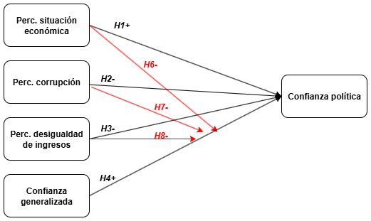

# Antecedentes conceptuales y empíricos

```{r echo=FALSE}
knitr::opts_chunk$set(out.width="80%", fig.pos = "!ht", out.extra = "")
```

## Confianza política

La confianza política se define como “la expectativa de que las instituciones políticas funcionen según reglas justas incluso en ausencia de escrutinio constante”[^2] [@marienMeasuringPoliticalTrust2013, p.16]. Para clarificar este concepto, resulta pertinente entenderlo como parte de  un conjunto de actitudes y comportamientos que funcionan como orientaciones evaluativas hacia los componentes del sistema político (comunidad nacional, régimen político y autoridades políticas), y que se pueden englobar en la idea de apoyo político [@eastonSystemsAnalysisPolitical1965; @eastonReassessmentConceptPolitical1975]. Para Easton [-@eastonSystemsAnalysisPolitical1965; -@eastonReassessmentConceptPolitical1975], el apoyo político se divide en apoyo específico, orientado hacia las autoridades en función de la evaluación de su desempeño, y apoyo difuso, dirigido hacia los principios y valores que subyacen al sistema político y a la comunidad que lo alberga. Mientras el primero oscila constantemente en función de la contingencia sociopolítica, el segundo se entiende como una "reserva de actitudes favorables o de buena voluntad" [@eastonSystemsAnalysisPolitical1965, p. 273] que lleva a que los individuos acepten y toleren los distintos *outputs* del sistema político aun cuando vayan en contra de sus intereses particulares. Si se opta por entender ambos tipos de apoyo como los extremos de un *continuum* [@norrisDemocraticDeficitCritical2011], es posible clasificar la confianza política como un indicador intermedio de apoyo, dirigido a las instituciones políticas del régimen [@monterogibertConfianzaSocialConfianza2008; @zmerliPoliticalTrust2022].

Situar la confianza política en el concepto más amplio de apoyo político permite distinguirla respecto a las orientaciones dirigidas a otros componentes del sistema político. Como ya se dijo, la confianza política es un tipo de actitud que va dirigido a un componente específico del sistema político, a saber, las instituciones del régimen político. En función de lo anterior, se asume que la relación que los ciudadanos entablan con estas instituciones es analíticamente distinta a la que mantienen tanto con los actores que las ocupan como con los principios abstractos que las rigen [@daltonDemocraticChallengesDemocratic2004; @eastonReassessmentConceptPolitical1975; @norrisDemocraticDeficitCritical2011]. Por un lado, la confianza política no se limita a un tipo de apoyo específico que los ciudadanos brindan a las instituciones en función de la evaluación que llevan a cabo del desempeño de las autoridades en un momento determinado. Esto implica reconocer que un ciudadano podría, por ejemplo, rechazar al presidente del senado y apoyar la institución del congreso. Esto, sin embargo, tampoco significa que la relación de los individuos con las instituciones se construya de forma independiente a estos desempeños, sino que, la capacidad de las instituciones para cumplir con determinados *outputs* a lo largo de un periodo estable de tiempo tiene como consecuencia que los ciudadanos confíen en estas más allá de los actores que la ocupen. Por otro lado, un individuo podría desconfiar de sus instituciones políticas sin que esto implique un rechazo a los valores que las orientan. A su vez, lo anterior implica asumir que para que las instituciones sean confiables a ojos de los individuos no es suficiente con tener una cultura política fuerte que ponga énfasis en el respeto al andamiaje político, aun cuando esto pueda ayudar [@almondCulturaCivicaEstudio1970; @eastonReassessmentConceptPolitical1975]. 

A partir de lo recientemente expuesto cabe preguntarse si los individuos se relacionan con todas las instituciones políticas por igual o si las juzgan con distintos criterios y expectativas. Desde el punto de vista teórico, se argumenta con Rothstein y Stolle [-@rothsteinStateSocialCapital2008] que es posible dividir en dos grupos el complejo entramado de instituciones que forman el sistema político. Por un lado, se encontrarían las instituciones políticas (gobierno, congreso y partidos políticos), las cuales tendrían como principio operar a partir de criterios partisanos y, por ende, en favor de la ideología que representan. Por otro lado, estarían el poder judicial y la policía, cuyo objetivo sería el de implementar la ley de forma imparcial. En este sentido, los autores argumentan que los ciudadanos evaluarían las primeras en función de su posición ideológica, mientras que a las segundas se les evaluaría en función de su neutralidad. Dicha distinción lleva a que algunos estudiosos del postmaterialismo como Inglehart [-@inglehartTrustWellbeingDemocracy1999] afirmen que los ciudadanos de las sociedades más desarrolladas rechazarían en mayor grado las instituciones de implementación, en cuanto estas se regirían por valores autoritarios. No obstante la relevancia de esta diferenciación en el plano teórico, en el plano empírico distintas investigaciones han llegado a la conclusión de que los individuos las evalúan de forma similar, siendo la policía la que en mayor grado evalúan diferente [@marienMeasuringPoliticalTrust2013; @zmerliObjectsPoliticalSocial2017]. Teniendo en cuenta lo anterior, en esta investigación se optará por usar el concepto de instituciones políticas para referirse al conjunto de instituciones que forman parte del régimen político, es decir, el ejecutivo, el congreso, el poder judicial y los partidos políticos, dejando fuera a la policía.

Habiendo delimitado el concepto de confianza política, se pasará a discutir en los siguientes apartados las dos perspectivas desde las que se ha llevado a cabo el estudio de sus factores asociados, a saber, la institucional y la sociocultural. A su vez, se presentarán las hipótesis que guiarán el análisis empírico.

[^2]: Traducción propia.

## Percepción del desempeño institucional

Quienes adoptan la perspectiva institucional señalan que la confianza política depende de la evaluación que llevan a cabo los ciudadanos sobre el desempeño de las instituciones del régimen político [@vandermeerEconomicPerformancePolitical2018]. Para corroborar esta afirmación, es posible adoptar distintos indicadores de desempeño político y económico. En el marco del presente estudio, se hará énfasis en el uso de tres: desempeño económico, corrupción y desigualdad en la distribución de ingresos. El enfoque sobre estos tres fenómenos se fundamenta en la importancia que estos tienen en el contexto chileno y latinoamericano, presentándose constantemente como una amenaza al buen funcionamiento de la democracia y posicionándose entre las prioridades de sus ciudadanos [@munckLatinAmericanPolitics2022a].

Desde esta perspectiva, la confianza política se concibe como un vínculo estratégico que se puede resumir bajo la famosa fórmula “A confía en B para que haga x”[^3] [@hardinWeWantTrust1999, p.26]. Esto implica que dicho concepto es relacional, en cuanto contempla un sujeto que confía y un objeto en quien se confía, y situacional, en cuanto refiere a cierto tipo de acción o contexto en el que se desenvuelve esta relación [@citrinPoliticalTrustCynical2018; @vandermeerEconomicPerformancePolitical2018; @vandermeerDeeplyRootedConcern2017]. A su vez, asume que entablar una relación de confianza implica un riesgo para el sujeto, el cual se encuentra en una relación de incertidumbre en torno al comportamiento que va a llevar a cabo el objeto en el que deposita su confianza. Es por esto que, desde el punto de vista de la confianza estratégica, la decisión de confiar depende en gran medida de la información y la experiencia que tenga el sujeto sobre el comportamiento del objeto de confianza [@uslanerMoralFoundationsTrust2002; @uslanerStudyTrust2017]. Así, podríamos decir que, para que A confíe en B para que haga x, A tiene que tener alguna certeza de que, desde la base de información sobre experiencias pasadas con B y con objetos del mismo tipo, B efectivamente es capaz de llevar a cabo x. 

En este sentido, se argumenta que la confianza en las instituciones políticas depende de la evaluación que los ciudadanos hagan de su desempeño en llevar a cabo determinados *outputs* en concordancia con las expectativas que tienen sobre estas. A grandes rasgos, los individuos en los regímenes democráticos valoran a sus instituciones en función de su capacidad para garantizar prosperidad económica para amplios sectores de la población, mediante un contexto económico y político en concordancia con valores como la justicia, la transparencia y la equidad [@andersonSensitiveLeftImpervious2008; @vandermeerEconomicPerformancePolitical2018; @vandermeerDeeplyRootedConcern2017; @zmerliPoliticalTrust2022; @zmerliIncomeInequalityDistributive2015]. Desde esta perspectiva, la confianza política se concibe como fundamentalmente endógena a las instituciones del régimen, y se encuentra susceptible de variar en función de los cambios económicos, sociales y políticos que ocurren al interior de un país [@newtonSocialPoliticalTrust2017].

[^3]: Traducción propia.


### Desempeño económico

En la literatura existe un consenso global en torno a la importancia que tiene para la confianza política la evaluación que los individuos llevan a cabo del ámbito económico [@eastonReassessmentConceptPolitical1975; @leeEconomicPerformanceIncome2020; @mishlerWhatAreOrigins2001; @norrisDemocraticDeficitCritical2011; @oskarssonGeneralizedTrustPolitical2010; @vandermeerEconomicPerformancePolitical2018; @wangGovernmentPerformanceCorruption2016]. Lo anterior implicaría que los ciudadanos valorarían sus instituciones en función de la capacidad que estas tienen de satisfacer sus necesidades materiales mediante el incremento en los estándares de vida de la población [@quarantaDoesEconomyReally2016; @thomassenSupportDemocraticValues1998; @mcallisterEconomicPerformanceGovernments1999]. A este respecto, es necesario tener en cuenta que esta evaluación no necesariamente se condice con lo informado por indicadores macroeconómicos objetivos [@vandermeerEconomicPerformancePolitical2018]. Esto se debe a que la percepción que los individuos construyen en este ámbito se ve mediada por otros factores como los medios de comunicación y las expectativas individuales [@mcallisterEconomicPerformanceGovernments1999]. A su vez, esta depende del indicador (tasa de desempleo, crecimiento económico, inflación, salarios reales, etc.) al que los individuos le den más importancia en un momento determinado [@daltonDemocraticChallengesDemocratic2004]. Teniendo esto en cuenta, las investigaciones previas han ocupado tanto mediciones macroeconómicas particulares como indicadores sobre la percepción general que los individuos tienen del estado de la economía. Respecto a la pertinencia de las primeras, las investigaciones arrojan resultados mixtos [@andersonCorruptionPoliticalAllegiances2003; @leeEconomicPerformanceIncome2020; @mishlerWhatAreOrigins2001; @vandermeerPoliticalTrustEvaluation2017]. Por el contrario, los indicadores de percepción del desempeño económico han demostrado consistentemente tener efecto sobre la confianza política. Lo anterior se ha comprobado en diversos contextos, como lo son las regiones de América del Norte y Europa Occidental [@oskarssonGeneralizedTrustPolitical2010; @torcalDeclinePoliticalTrust2014a; @torcalPoliticalTrustWestern2017], Europa Oriental [@mishlerWhatAreOrigins2001], África [@stoyanTrustGovernmentInstitutions2016] y América Latina [@bargstedPoliticalTrustLatin2017; @mainwaringStateDeficienciesParty2006; @mattesSocialPoliticalTrust2018; @stoyanTrustGovernmentInstitutions2016; @zmerliIncomeInequalityDistributive2015]. A su vez, la presencia de este efecto se ha mantenido en el caso chileno [@riffoQueInfluyeConfianza2019; @saldanazunigaConfianzaInstitucionesPoliticas2019; @segoviaMalaiseDemocracyChile2016].

En paralelo, también es importante dar cuenta de que la percepción del desempeño económico puede articularse desde dos puntos de vista [@vandermeerEconomicPerformancePolitical2018]: por un lado, desde una perspectiva sociotrópica que pone el foco en las condiciones económicas nacionales; por otro lado, desde una perspectiva egotrópica que pone el foco en las circunstancias económicas individuales. En el marco de su relación con la confianza política, se argumenta que este indicador es evaluado en mayor grado a partir de criterios colectivos (sociotrópicos) que de criterios individuales (egotrópicos) [@mcallisterEconomicPerformanceGovernments1999]. Esto último es apoyado por la evidencia empírica, en la cual las evaluaciones sociotrópicas han demostrado un mayor efecto en la confianza institucional que las evaluaciones egotrópicas [@mainwaringStateDeficienciesParty2006; @torcalDeclinePoliticalTrust2014a; @torcalResponsivenessPerformanceCorruption2021; @vandermeerEconomicPerformancePolitical2018]. De esta forma, para efectos de esta investigación conviene centrarse en la evaluación que los individuos llevan a cabo de la situación económica nacional. No obstante lo anterior, es necesario aclarar que esta evaluación sociotrópica del desempeño económico puede manifestarse en distintas temporalidades, ya sea en retrospectiva, en el presente o respecto al futuro. Las percepciones derivadas de estas, aunque relacionadas, podrían diferir entre sí [@torcalResponsivenessPerformanceCorruption2021]. Pese a la importancia de la temporalidad en la evaluación, las investigaciones previas no le han prestado suficiente atención, utilizando indicadores que adoptan una u otra temporalidad sin mayor justificación [@mainwaringStateDeficienciesParty2006; @leeEconomicPerformanceIncome2020; @oskarssonGeneralizedTrustPolitical2010]. En contraste, en esta investigación se buscará medir la percepción de la situación económica nacional teniendo en cuenta la evaluación que los individuos llevan a cabo de este fenómeno en estas tres etapas: pasado, presente y futuro.

Teniendo en cuenta estas consideraciones, se presenta la primera hipótesis de la investigación:

  - *H1: La percepción de la situación económica nacional se relaciona positivamente con la confianza política. Es decir, los ciudadanos que evalúan de mejor forma la situación económica del país tendrán un mayor nivel de confianza política que los ciudadanos que evalúan de peor forma esta situación.* 

### Corrupción 

Junto con el desempeño económico, la literatura ha destacado la importancia de la relación entre la corrupción y la confianza política. En concordancia con otras investigaciones, el concepto de corrupción se entiende como "el uso indebido del cargo público para beneficio privado"[^4] [@sandholtzAccountingCorruptionEconomic2000, p.32]. A partir de esta definición es posible afirmar que este fenómeno socava principios básicos de la democracia, como son la transparencia en la toma de decisiones, la justicia e imparcialidad en la aplicación de leyes y el acceso equitativo al proceso político -como participante directo o como beneficiario- [@andersonCorruptionPoliticalAllegiances2003]. En contraste con estos ideales normativos, la corrupción entrega ventajas a unos sobre otros, debilitando así la creencia de que las instituciones y sus ocupantes actúan en beneficio del interés general y no orientados hacia intereses particulares [@beesleyCorruptionInstitutionalTrust2022; @uslanerCorruptionInequalityTrap2013]. Inicialmente, el mal uso de los recursos públicos y de las ventajas asociadas a posiciones al interior del aparato político-estatal puede ser atribuible a la deshonestidad de algunos funcionarios, lo que no implicaría necesariamente una peor evaluación de las instituciones políticas. Sin embargo, la regularización de episodios de este tipo a lo largo del tiempo llevaría a que los ciudadanos perciban estos comportamientos como parte del funcionamiento de las instituciones y, por tanto, disminuiría la confianza que depositan en estas [@beesleyCorruptionInstitutionalTrust2022]. En este sentido, los individuos que identifican el mal uso de fondos públicos para fines privados como una práctica recurrente al interior de una institución, van a calificar a esta de deshonesta e injusta, tendiendo a confiar menos en ella [@uslanerCorruptionInequalityTrap2013].

Diversas investigaciones han estudiado el vínculo que habría entre la corrupción y la confianza en las instituciones. A diferencia de lo ocurrido con el desempeño económico, para el caso de la corrupción tanto indicadores a nivel macro como la percepción de los individuos han demostrado tener un efecto significativo en el nivel de confianza política. Aunque demuestra ser importante en países con niveles relativamente menores de corrupción [@andersonCorruptionPoliticalAllegiances2003; @vandermeerPoliticalTrustEvaluation2017; @wangGovernmentPerformanceCorruption2016], este fenómeno cobra mayor relevancia en regiones con altos niveles de corrupción pública, como lo es el caso de América Latina. En este sentido, distintos estudios han revelado la centralidad que tiene la corrupción en la evaluación que los ciudadanos latinoamericanos hacen del desempeño de sus instituciones [@boothLegitimacyPuzzleLatin2009; @mainwaringStateDeficienciesParty2006; @morrisCorruptionTrustTheoretical2010; @seligsonImpactCorruptionRegime2002a; @stoyanTrustGovernmentInstitutions2016]. Para el caso chileno, al igual que en lo respectivo al desempeño económico, la tendencia global y regional se mantiene, por lo que se encuentra un efecto significativo de la corrupción pública en la confianza institucional [@riffoQueInfluyeConfianza2019; @saldanazunigaConfianzaInstitucionesPoliticas2019; @segoviaMalaiseDemocracyChile2016].

En base a lo anterior, se propone la segunda hipótesis de la investigación: 

  - *H2: El progreso en reducir la corrupción se relaciona positivamente con la confianza política. Lo anterior significa que los ciudadanos que perciban un mayor progreso en reducir la corrupción en el país van a tener un mayor nivel de confianza política respecto a los ciudadanos que perciban un menor progreso en reducir la corrupción.* 

[^4]: Traducción propia.

### Justicia distributiva

Por último, en las últimas décadas han surgido distintos autores que afirman la importancia que las percepciones de la distribución de ingresos tendrían en la construcción de los juicios de confianza en las instituciones políticas [@vandermeerEconomicPerformancePolitical2018]. Este planteamiento se erige, en concordancia con la teoría de la privación relativa, sobre el supuesto de que los individuos evalúan los productos de las instituciones políticas en referencia a estándares sobre lo que constituiría un resultado justo [@tylerSocialJustice2015]. En el caso de la desigualdad en la distribución de la riqueza, estos estándares estarían basados, por lo general, en tres principios: la igualdad, la equidad y la satisfacción de las necesidades básicas de cada uno [@tylerSocialJustice2015; @zmerliIncomeInequalityDistributive2015]. Estos principios constituyen lo que se conoce como "justicia distributiva". Según este concepto, en la medida en que los ciudadanos consideren la distribución de ingresos incompatible con cualquiera de estos principios, percibirán que se han transgredido dichos principios y confiarán menos en las instituciones políticas, atribuyéndoles la responsabilidad de mejorar esta situación [@tylerInfluencePerceivedInjustice1985; @zmerliIncomeInequalityDistributive2015].

La evidencia empírica sobre la relación entre justicia distributiva y confianza política ha demostrado ser consistente en distintas investigaciones. En este sentido, se evidencia que los ciudadanos que perciben una mayor desigualdad de ingresos al interior de sus comunidades tienden a calificar esta distribución como injusta, y por ende a demostrar menores niveles de confianza en sus instituciones políticas [@bobzienIncomeInequalityPolitical2023; @leeEconomicPerformanceIncome2020; @schnaudtDistributiveProceduralJustice2021]. A su vez, esta relación resulta extrapolable a contextos con niveles altos de desigualdad de ingresos como el latinoamericano [@garcia-sanchezEconomicInequalityUnfairness2025a; @granadosRaceInequalityPolitical2025; @zmerliIncomeInequalityDistributive2015]. No obstante lo anterior, no se encontraron investigaciones empíricas que den cuenta de esta relación para el caso chileno, más allá de su inclusión en estudios que se concentran en el contexto regional. Aun así, la creciente politización de la desigualdad presente en la última década y su incidencia en la participación política invitan a pensar que Chile debería seguir el patrón latinoamericano a este respecto [@castilloInequalityDistributiveJustice2015]. Teniendo en cuenta lo anterior, se identifica la necesidad de producir información que permita dilucidar la particularidad de la relación entre justicia distributiva y confianza en las instituciones políticas en Chile. 

A partir de los antecedentes expuestos, se plantea la tercera hipótesis de la investigación: 

  - *H3: La percepción de justicia distributiva se relaciona positivamente con la confianza política. Esto significa que los ciudadanos que perciban como justa la distribución de ingresos en el país van a tener un mayor nivel de confianza política respecto a los ciudadanos que la perciban  como injusta.*

## Confianza generalizada

Para entender el vínculo entre confianza generalizada y confianza política, es necesario situar la primera dentro de la literatura sobre el capital social y su relación con la democracia. Para Putnam [-@putnamMakingDemocracyWork1993], uno de los principales exponentes de esta teoría, el capital social refiere a "características de la organización social, tales como la confianza, las normas y las redes, que pueden mejorar la eficiencia de la sociedad al facilitar acciones coordinadas" [^5] (p. 167). Partiendo de esta definición, el autor va a argumentar que dichas características -a saber, la confianza generalizada, las normas de reciprocidad y las redes de participación- funcionan como las bases que permiten a los individuos tomar un rol activo en sus comunidades y cooperar entre sí para lograr fines comunes. Esta capacidad de cooperación, a su vez, sería el sostén sobre el cual se erigen instituciones democráticas eficientes y estables en el tiempo. Aunque Putnam va a profundizar esta teoría poniendo énfasis en la importancia de las asociaciones voluntarias para el buen funcionamiento democrático [@putnamBowlingAloneCollapse2000], otros investigadores van a poner énfasis en la idea de que la confianza generalizada sería la piedra sobre la cual se construyen el resto de actitudes y comportamientos mencionados y, por tanto, sería el componente esencial del capital social. Según esta linea de investigación, en sociedades altamente impersonales y diversas como son las modernas, la confianza en los otros -más allá de los círculos familiares- reduce el riesgo asociado a participar de la vida cívica y por tanto facilita que los ciudadanos adopten un rol activo en sus comunidades [@uslanerDemocracySocialCapital1999]. En este sentido, la confianza en los demás estaría a la base de un conjunto de orientaciones, actitudes y comportamiento que funcionarían a la manera de un circulo virtuoso, el cual se  traduciría en ciudadanos más dispuestos a participar de su comunidad y más propensos a confiar en que las instituciones políticas actúan de forma justa y orientada hacia el bien común [@zmerliSocialTrustAttitudes2008].

Pese a que este argumento ha sido ampliamente defendido por la comunidad académica desde el punto de vista teórico, la evidencia empírica sobre la relación entre confianza generalizada y confianza política ha estado lejos de ser concluyente. A finales de la década de los 90 diversas investigaciones reportaron encontrar una débil -o nula- relación entre ambos tipos de confianza [@kaaseInterpersonalTrustPolitical1999; @newtonSocialPoliticalTrust1999; @newtonConfidencePublicInstitutions2000]. Mas recientemente, mejoras en la medición de ambos conceptos han llevado a que se encuentre una relación, sin embargo, la influencia de la confianza generalizada en el fenómeno de interés ha demostrado ser comparativamente menor que la de factores asociados a la percepción del desempeño institucional. Lo anterior tanto en otras regiones [@dellmuthWhyNationalInternational2020; @newtonSocialPoliticalTrust2017; @rahnTalePoliticalTrust2005; @torcalDeclinePoliticalTrust2014a] como en América Latina [@granadosRaceInequalityPolitical2025; @mainwaringStateDeficienciesParty2006; @morrisCorruptionTrustTheoretical2010]. Frente a la posibilidad de que estos resultados lleven a la apresurada conclusión de que para entender la construcción de la confianza política es suficiente con dar cuenta de sus variables institucionales, se argumenta que la dificultad para encontrar en la práctica lo que se plantea en la literatura del capital social podría ser la consecuencia de un malentendido sobre la naturaleza del vínculo entre ambos tipos de confianza [@oskarssonGeneralizedTrustPolitical2010]. En particular, se defiende a partir de los postulados de Uslaner [-@uslanerMoralFoundationsTrust2002; -@uslanerStudyTrust2017] que, mientras las investigaciones previas se han limitado a entender esta relación como *exclusivamente* directa, el verdadero potencial de la confianza generalizada se encuentra en moderar la relación entre la percepción del desempeño y la confianza política. 

Uslaner [-@uslanerMoralFoundationsTrust2002; -@uslanerStudyTrust2017] amplía el debate sobre la confianza argumentando que el tipo de vínculo racionalmente orientado que se describió en el apartado anterior, al cual va a llamar confianza estratégica, es solo uno de los tipos de confianza. Para el autor, este tipo, que presupone la existencia de una experiencia previa que funciona como información sobre la conducta del objeto en el que se deposita la confianza, solo permite explicar por qué los individuos confían en personas que conocen o que son como ellos mismos (ya sea por lazos de clase, étnicos o religiosos).  Sin embargo, esta no permite explicar por qué los individuos confían en desconocidos, es decir, en personas ajenas, que probablemente no se parecen a ellos, y de los cuales no tienen ninguna evidencia o información que les permita predecir su comportamiento o actitud. Esta disposición a confiar en desconocidos no es sobre un cálculo racional sino que, por el contrario, descansa sobre una confianza moral, es decir, sobre la base de una convicción de que los otros comparten sus propios valores y, por ende, son parte del mismo universo moral.

Bajo esta perspectiva, la confianza generalizada se define como la “percepción de que la mayoría de la gente forma parte de tu comunidad moral” [@uslanerMoralFoundationsTrust2002, p. 26]. Esta se traduce en una expectativa positiva sobre la buena voluntad de la gente en general. Siguiendo la lógica de Hardin (1999) expuesta en el apartado anterior, si la confianza estratégica se puede sintetizar como “A confía en B para que haga x”, Uslaner resume la confianza moral con la frase “A confía” [@uslanerMoralFoundationsTrust2002, p. 21]. La última, a diferencia de la primera, no contempla un objeto particular en el que se confía ni un contexto y un propósito determinados. Por el contrario, la disposición a confiar en los otros descansa en creencias arraigadas al interior del individuo sobre la buena voluntad del resto, las cuales se transmiten durante las etapas tempranas de la socialización y se mantienen con cierta estabilidad a lo largo del tiempo, resultando menos susceptibles a cambiar en función de malas experiencias. 
	
A su vez, la confianza generalizada se entiende como uno de los polos en un *continuum* que del otro lado tiene a la confianza particularizada, que implica la percepción de que solo tus cercanos y gente parecida a ti forma parte de tu comunidad moral. De esta forma, la posición en este *continuum* depende del grado en el que un individuo pueda ser caracterizado como un confiador estratégico o moral [@oskarssonGeneralizedTrustPolitical2010]. Por un lado, una persona que construye sus vínculos de confianza únicamente sobre la base de información que tiene sobre el otro es probable que limite su comunidad moral a los individuos que conoce o con los que tiene características en común. Por otro lado, un individuo que entabla sus relaciones de confianza a partir de una predisposición a confiar que descansa sobre una convicción ética es capaz de expandir su comunidad moral más allá de sus círculos similares. 

Teniendo en cuenta todo lo anterior, y como se dijo al principio de este apartado, se argumenta que comprende un malentendido interpretar la relación entre confianza generalizada y confianza política como *exclusivamente* directa. Esta confusión remite a que en la literatura se ha tendido a concebir la confianza en los otros como una confianza de tipo estratégica, racional y evaluativa. La distinción entre esta concepción de la confianza generalizada y aquella que Uslaner [-@uslanerMoralFoundationsTrust2002; -@uslanerStudyTrust2017] denomina como confianza moral radica en la diferencia en sus fundamentos: mientras la primera refleja la evaluación de las personas que conocemos o que se parecen a nosotros, la segunda refleja una perspectiva optimista sobre las personas en general. Profundizando en esta última perspectiva, se argumenta que la confianza generalizada es un lente a través del cual cierto tipo de individuo interpreta el mundo que lo rodea de forma positiva [@oskarssonGeneralizedTrustPolitical2010]. Siguiendo esta lógica, se propone que aquellas personas con niveles más altos de confianza generalizada manifestarían un mayor grado de confianza en las instituciones políticas, en cuanto proyectarían en estas su perspectiva optimista. No obstante lo anterior, la idea de confianza  que aquí se plantea obliga a ir más allá de esta afirmación, complementándola con el planteamiento de que la confianza generalizada tiene la capacidad de moderar la relación entre la percepción del desempeño de las instituciones y la confianza en estas. Lo anterior radica en el supuesto de que los individuos que confían en los otros, al poseer una predisposición a confiar que no depende de la información que tienen del objeto en el que se confía, serían menos sensibles a disminuir su confianza en las instituciones políticas en función de una evaluación negativa de su desempeño.

Desde el punto de vista empírico, no se han encontrado intentos por investigar el efecto moderador de la confianza generalizada en la relación entre percepción del desempeño y confianza política. Lo más cercano es la empresa llevada a cabo por Oskarsson [-@oskarssonGeneralizedTrustPolitical2010], en la cual se utilizan datos de la *European Social Survey* (olas 2002 y 2004) para poner a prueba la hipótesis de que la confianza generalizada mitigaría el efecto que la evaluación del desempeño del sistema político tendría sobre el apoyo político. En esta, se utiliza el concepto de apoyo político en reemplazo del de confianza política, y se operacionaliza mediante un índice que comprende la satisfacción con el funcionamiento de la democracia, así como la confianza en tres instituciones: el congreso, el poder judicial y la policía. A partir de este marco, el autor presenta evidencia de que el efecto de la percepción del desempeño en el apoyo político tiene una menor intensidad en aquellos individuos que reportan un mayor grado de confianza generalizada. Pese a la importancia de estos resultados, la investigación de Oskarsson presenta algunas limitaciones. La primera de ellas es conceptual, y remite a la unión en un solo indicador de las actitudes que los individuos tienen respecto a dos dimensiones de apoyo político distintas entre sí, las cuales deberían estudiarse por separado, como lo son la evaluación del desempeño del régimen y la confianza en las instituciones del régimen [@norrisDemocraticDeficitCritical2011]. A este respecto, se argumenta que el efecto moderador de la confianza generalizada podría estar presente en las actitudes de solo una de estas dos dimensiones. La segunda limitación tiene que ver con el contexto en el que se aplica, en cuanto se evidencia que en Europa los niveles de confianza generalizada y política son considerablemente mayores que en otras regiones del mundo [@bargstedSocialPoliticalTrust2023; @mattesSocialPoliticalTrust2018]. En este sentido, se busca mediante la presente investigación superar estas limitaciones.
  
A la luz de la discusión anterior, se postulan las siguientes hipótesis:

  - *H4: La confianza generalizada se relaciona positivamente con la confianza política. Es decir, los ciudadanos que reporten un mayor grado de confianza en la mayoría de las personas van a tener un mayor nivel de confianza política respecto a los ciudadanos que reporten un menor grado de confianza en la mayoría de las personas.*
  
  - *H5: La relación entre percepción de la situación económica del país y nivel de confianza política se ve moderada negativamente por la confianza generalizada. Esto significa que el efecto de la percepción de la situación económica del país sobre el nivel de confianza política será menor en ciudadanos que reporten confiar en la mayoría de las personas respecto a ciudadanos que no lo hagan.* 
  
  - *H6: La relación entre el progreso en reducir la corrupción y el nivel de confianza política se ve moderada negativamente por la confianza generalizada. Esto quiere decir que el efecto del progreso en reducir la corrupción en el país sobre el nivel de confianza política será menor en ciudadanos que reporten confiar en la mayoría de las personas respecto a ciudadanos que no lo hagan.*
  
  - *H7: La relación entre justicia distributiva y nivel de confianza política se ve moderada negativamente por la confianza generalizada. Lo anterior significa que el efecto de la justicia distributiva sobre el nivel de confianza política será menor en ciudadanos que reporten confiar en la mayoría de las personas respecto a ciudadanos que no lo hagan.*
  
  
[^5]: Traducción propia.


## Las particularidades del caso chileno

La confianza política en Chile lleva décadas en caída libre. Al analizar los datos que la Encuesta Latinobarómetro entrega para el periodo entre 1995 hasta la actualidad, es posible evidenciar una baja persistente en la evaluación ciudadana de las instituciones políticas del país [^6]. A lo largo de este periodo la institución que sufrió una mayor merma es el congreso, que pasó de un 47% de confianza el primer año a un 19% en 2024. En segundo lugar se encuentra el gobierno, cuya confianza decayó de un 59% a un 33%, aunque con mayores fluctuaciones en el tiempo que el resto de instituciones [@bargstedCulturaPoliticaDiagnostico2018]. En penúltimo lugar está el poder judicial, que vio reducida su confianza de un 39% a un 18%. Por último, la confianza en los partidos políticos es la que disminuyó en menor medida durante estos años, partiendo ya con una baja confianza de tan solo 32% a principios del periodo, y encontrándose ahora mismo en un 12%. Si se compara la posición relativa de cada una de estas instituciones entre sí en cuanto a la confianza que generan en los chilenos, es posible ver que el orden se ha mantenido estable, siendo el partido político la que menos confianza genera, seguido por el poder judicial, el congreso y, en lo más arriba de la lista, el gobierno. A su vez, datos del PNUD [-@pnudDiezAnosAuditoria2019] indican que entre 2008 y 2018 desaparecieron las diferencias que existían en el juicio de confianza política según edad, nivel educacional, identificación con el eje izquierda y derecha, y pertenencia a zonas urbanas y rurales. Al situar estos datos a nivel regional, se evidencia que las instituciones chilenas tienen un nivel de confianza similar al del resto de países de la región, lo cual es preocupante si se tiene en consideración que América Latina es una de las regiones que menor confianza reporta en sus instituciones políticas [@mattesSocialPoliticalTrust2018; @pnudDiezAnosAuditoria2019].

El caso chileno resulta especialmente interesante para el estudio de los factores asociados a la confianza política. Su particularidad radica en la contradicción, persistente desde el retorno a la democracia en 1990 hasta la actualidad, entre las mejoras sustantivas en las condiciones de vida de la población y el extendido descontento frente a las instituciones políticas [@huneeusDemocraciaSemisoberanaChile2014; @pnudChile20Anos2017]. Por un lado, se evidencia que el PIB per cápita chileno aumentó durante este periodo desde 9.302 dolares a 24.431, a la vez que se redujo la pobreza de un 68.5% a un 6,5 % [@pnudInformeSobreDesarrollo2024]. En paralelo, se mantenido una baja corrupción política [@coppedgeVDemDatasetV152025], a la vez que se ha disminuido la desigualdad por ingreso, aunque esta última sigue siendo una de las más grandes de América Látina y la más grande entre los países OCDE [@pnudInformeSobreDesarrollo2024; @worldbankPovertyInequalityPlatform2025]. En este sentido, Chile es lugar de una paradoja entre la actitud de los ciudadanos hacia sus instituciones políticas y el desempeño general de estas [@castiglioniChallengesPoliticalRepresentation2016]. Por un lado, los ciudadanos muestran cada vez más desconfianza en sus instituciones y, por otro lado, estas últimas han logrado mantener un desempeño económico decente y una estabilidad política aceptable incluso en momentos de crisis como lo fue el estallido social de 2019.

La distancia entre desempeño y confianza política que presenta el caso chileno lleva a pensar que en la construcción de esta última podrían estar incidiendo con especial importancia factores exógenos a la institucionalidad política, como lo es la confianza generalizada. En la actualidad, tan solo un 15% de los ciudadanos chilenos indica que se puede confiar en la mayoría de las personas, mínimo histórico que se enmarca en una caída constante desde 2011 [@pnudInformeSobreDesarrollo2024]. Esta caída ha sido más pronunciada que la que se evidencia en el promedio global y el de América Latina [@livertDeterminantesConfianzaSocial2024]. Esta baja confianza en los demás, entre otras cosas, ha llevado a un retraimiento de los chilenos hacia sus círculos más íntimos, compuestos por familiares, amigos y conocidos, tendencia que se empieza a divisar desde la última década del siglo pasado [@cousinoSociabilidadAsociatividadEnsayo2000]. La ausencia de confianza generalizada se encuentra a la base de un proceso más amplio de erosión del lazo social, el cual es explicado por Araujo [-@araujoDesmesurasDesencantosIrritaciones2019; -@araujoCircuitoDesapegoNeoliberalismo2025a] haciendo referencia a un "circuito del desapego" que se habría forjado en los chilenos a la sombra de la interacción entre, por un lado, la persistencia del modelo de sociedad neoliberal y, por otro lado, los empujes a la democratización de las relaciones sociales que surgen con especial fuerza a principios de la década pasada. Para la autora, este circuito estaría caracterizado por la experiencia de la desmesura de las exigencias de la vida cotidiana y de las desigualdades en las interacciones, el desencanto con las promesas de movilidad ascendente y de horizontalidad en el trato, la irritación frente a las relaciones con la sociedad y sus instituciones y, por último, el desapego, el cual se expresaría en un distanciamiento respecto a las normas, reglas e instituciones que históricamente habían sido servido como fundamento de la vida en común. Así, la sociedad chilena es caracterizada como una "sociedad archipielago", en la cual conviven individuos fuertemente individualizados que se ven a sí mismos y a sus círculos cercanos como los únicos capaces de sostener su vida, mientras que perciben a las instituciones políticas como abusivas y prescendibles [@araujoCircuitoDesapegoNeoliberalismo2025a].  

A partir de estas consideraciones sobre la paradoja entre el desempeño positivo de las instituciones políticas chilenas y las actitudes negativas de sus ciudadanos hacia estas, sumado al reconocimiento de la baja confianza generalizada y la progresiva erosión del lazo social que se encuentran en la sociedad chilena, se argumenta que el caso elegido podría tener la particularidad de alejarse de la tendencia encontrada en el resto de países en cuanto a los factores asociados a la confianza política. En particular, se plantea la posibilidad de que la confianza generalizada tenga un peso mayor que la percepción del desempeño institucional en la construcción de los juicios de confianza que los ciudadanos chilenos llevan a cabo de sus instituciones políticas. De esta forma, se plantea la última hipótesis de este estudio:

 *H8: La confianza generalizada presenta una asociación con la confianza política de mayor magnitud que la percepción del desempeño institucional. Lo anterior implica que el efecto de la confianza generalizada sobre la confianza política va a ser de mayor tamaño que el de los distintos indicadores de la percepción del desempeño sobre la misma variable.*

A modo de ilustración, en la Figura \@ref(fig:grafico-1) se presenta un esquema con las hipótesis propuestas:

```{r grafico-1, fig.align='center', fig.cap="Esquema de presentación de hipótesis. En rojo se presentan los efectos de interacción. Se omite la hipótesis 8. Fuente: Elaboración propia.", echo=FALSE}



```


[^6]: El porcentaje de confianza se calcula sumando las respuestas "Algo de confianza" y "Mucha confianza" en cada una de las instituciones mencionadas.

