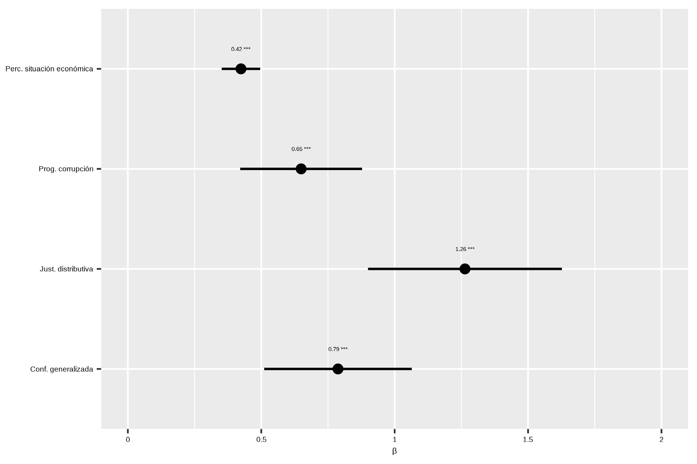
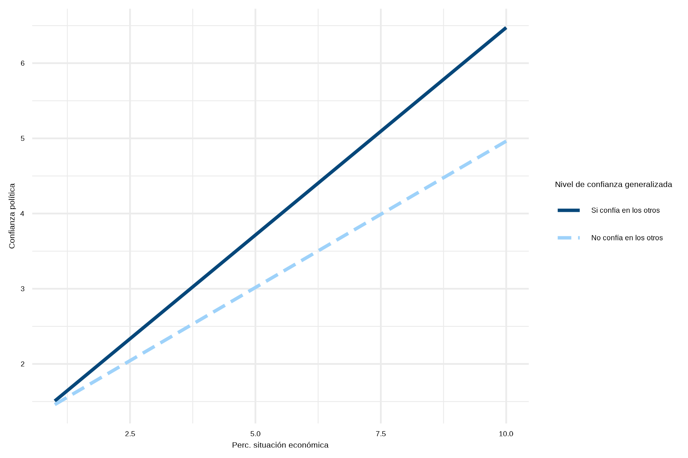

# Análisis

## Análisis descriptivo

```{r, echo=FALSE}

tabla_descriptivos <- readRDS("IPO/output/tables/tabla_descriptiva.rds")

```

```{r tabla-1, echo=FALSE, results='asis', message=FALSE, warning=FALSE}

library(kableExtra)

knitr::kable(tabla_descriptivos, 
             caption =  "Estadísticas descriptivas",
             format = "html") |> 
 kable_styling() |>
  footnote(
    general = c("Media (Desviación estándar) para variables continuas; n (%) para categóricas.",
      "Fuente: Elaboración propia en base a Latinobarómetro 2024."),
    general_title = "*Notas:*",  
    threeparttable = FALSE 
  )


```


En la Tabla \@ref(tab:tabla-1) se presentan las estadísticas descriptivas de las variables incluidas en el análisis. En esta, se observa que los ciudadanos chilenos poseen un bajo nivel de confianza en sus instituciones políticas, obteniendo un promedio de 3.59 (*de* = 2.06) en el índice de confianza política. De esta forma, los datos analizados mantienen la tendencia mostrada por anteriores estudios. En lo que refiere a la percepción de la situación económica nacional, se observa un nivel promedio de satisfacción de 5.17 (*de* = 1.69), lo que indicaría una evaluación moderada en este ámbito. A su vez, se evidencia una evaluación negativa del desempeño de las instituciones estatales en el combate de la corrupción, con solo un 35% de personas que indican que se ha progresado a este respecto en los últimos dos años. Lo anterior se profundiza en lo que respecta a la desigualdad de ingresos, con solo un 10% de individuos que califica como justa la distribución de ingresos en el país. Por ultimo, destaca el bajo nivel de confianza generalizada evidenciado, con solo un 19% de sujetos que declaran poder confiar en la mayoría de las personas.


```{r grafico-2, fig.width=8, fig.height=6, out.width='100%', fig.align='center', fig.cap="Matriz de correlaciones entre las variables principales del estudio. Fuente: Elaboración propia en base a Latinobarometro 2024.", echo=FALSE}

knitr::include_graphics("IPO/output/graphs/corrplot.png")

```


Por otro lado, en la Figura \@ref(fig:grafico-2) se expone una matriz de correlaciones en la que se evidencia el grado de asociación de las distintas variables principales entre sí. En esta, se observa que todas las variables independientes se asocian positivamente con la variable de confianza política, aunque con distinto grado de intensidad. En este sentido, la percepción de la situación económica nacional presenta una correlación moderada-alta con este indicador (*r* = 0.50, p < 0.001). El resto de variables exhiben un grado moderado de asociación, siendo la justicia distributiva (*r* = 0.33, p < 0.001) la que presenta una mayor intensidad, seguida de la evaluación del progreso en reducir la corrupción (*r* = 0.32, p < 0.001)  y, por último, de la confianza generalizada (*r* = 0.31, p < 0.001).

## Modelos

```{r tabla-regresiones, results='asis', echo=FALSE}

cat('<table>
  <caption>(#tab:tabla-regresiones) Resultados modelos de regresión lineal MCO</caption>
</table>')

cat(readLines("IPO/output/tables/tabla_regresiones.html"), sep = "\n")

```
<p style="font-size: 0.9em; font-style: italic;"> Fuente: Elaboración propia en base a Latinobarómetro 2024. </p> 


Cómo se puede observar en la Tabla \@ref(tab:tabla-regresiones), se construyeron un total de seis modelos de regresión lineal siguiendo una estrategia incremental, en la cual se van incorporando nuevos términos a la regresión para comprobar si se mantienen los efectos percibidos. Siguiendo esta lógica, el Modelo 1 se calculó solo con las variables de percepción del desempeño. Luego, en los Modelos 2 y 3 se introdujeron, respectivamente, la variable de confianza generalizada y las variables de control. Por último, en los modelos 4, 5 y 6 se introdujeron cada uno de los términos de interacción por separado.

Examinando los resultados de los primeros dos modelos, se observa que tanto las variables de percepción del desempeño como la de confianza generalizada presentan efectos estadísticamente significativos que se mantienen en ambas estimaciones. Por un lado, en lo que respecta a las primeras (Modelo 1) se advierte que aquellos individuos que poseen una percepción más positiva de la situación económica del país presentan, en promedio, 0.49 puntos adicionales (*se* = 0.03, p < 0.001) en el índice de confianza política. A su vez, los ciudadanos que evalúan positivamente el progreso obtenido en combatir la corrupción en las instituciones del Estado aumentan en promedio 0.77 puntos (*se* = 0.12, p < 0.001) su valor en la variable dependiente. Aún mayor es el efecto de la justicia distributiva, en cuanto los individuos que califican como justa la distribución de ingresos en el país aumentan en promedio 1.56 (*se* = 0.18, p < 0.001) puntos su confianza en las instituciones políticas. Por otro lado, se evidencia que, al igual que las variables de percepción del desempeño, la confianza generalizada tiene un efecto positivo sobre la confianza política (Modelo 2). En particular, las personas que declaran confiar en la mayoría de las personas reportan, en promedio, 0.87 puntos adicionales (*se* = 0.14, p < 0.001) en en el indice de confianza política.

```{r grafico-3, fig.width= 8, fig.height=6, out.width='100%', fig.align='center', fig.cap="Comparación coeficientes de regresión Modelo 3. Fuente: Elaboración propia en base a Latinobarómetro 2024.", echo=FALSE}



```


Al comparar las estimaciones de estos dos modelo con las del Modelo 3, se observa que la variable que se mantiene más estable a lo largo de las distintas mediciones es la de percepción de la situación económica nacional, cuyo efecto disminuye en 0.7 unidades. Respecto a las otras, se evidencia que la evaluación del progreso en reducir la corrupción disminuye en 0.12 unidades, mientras que el efecto de la justicia distributiva se reduce en 0.30 unidades, siendo la variable menos robusta entre las variables independientes. Por último, el efecto de la confianza generalizada disminuye en 0.8 unidades, mostrándose igual de robusta que la percepción de la situación económica. No obstante los cambios, estas variables se mantienen estadísticamente significativas, de manera tal que es posible aceptar las hipótesis *H1*, *H2*, *H3* y *H4*. En contraste, al comparar entre sí la magnitud del efecto que las distintas variables dependientes tienen sobre el índice de confianza política (véase Figura \@ref(fig:grafico-3)), se evidencia que los resultados no permiten aceptar la Hipótesis *H5*. Lo anterior debido a que el efecto de la confianza generalizada sobre la confianza política es mayor que el de algunas variables de percepción del desempeño político, siendo solo superado por el efecto de la percepción de la desigualdad de ingresos.

```{r tabla-interacciones, results='asis', echo=FALSE}

cat('<table>
  <caption>(#tab:tabla-interacciones) Resultados modelos de regresión lineal MCO con interacciones</caption>
</table>')

cat(readLines("IPO/output/tables/tabla_interacciones.html"), sep = "\n")

```
<p style="font-size: 0.9em; font-style: italic;"> Fuente: Elaboración propia en base a Latinobarómetro 2024. </p> 

Por último, en la Tabla \@ref(tab:tabla-interacciones) se presentan los modelos que incluyen los efectos de moderación de la confianza generalizada en la relación de cada una de las variables de percepción del desempeño con la variable dependiente. En esta, se observa que la confianza generalizada produce un efecto de moderación positiva sobre el efecto de la percepción de la situación económica nacional en la confianza política. Lo anterior significa que a mayor nivel de confianza generalizada, el efecto positivo de la percepción de la situación económica nacional en la confianza política aumenta en 0.16 unidades (*se* = 0.08, p < 0.05). Esta relación se ve ilustrada en la Figura \@ref(fig:grafico-4). Al contrastar dicho resultado con la hipótesis *H6*, se observa que aún cuando la moderación predicha esté presente, esta no permite confirmar la hipótesis en cuanto presenta un sentido distinto al previamente estipulado. En lo que respecta al resto de variables, se evidencia que la confianza generalizada no presenta efectos de moderación estadisticamente significativos en la relación de las otras variables de percepción del desempeño con la confianza política, lo que obliga a rechazar las hipótesis *H7* y *H8*. 

```{r grafico-4, fig.width= 8, fig.height=6, out.width='100%', fig.align='center', fig.cap="Efecto de la percepción de la situación económica sobre la confianza política moderado por el nivel de confianza generalizada. Fuente: Elaboración propia en base a Latinobarómetro 2024.", echo=FALSE}



```
